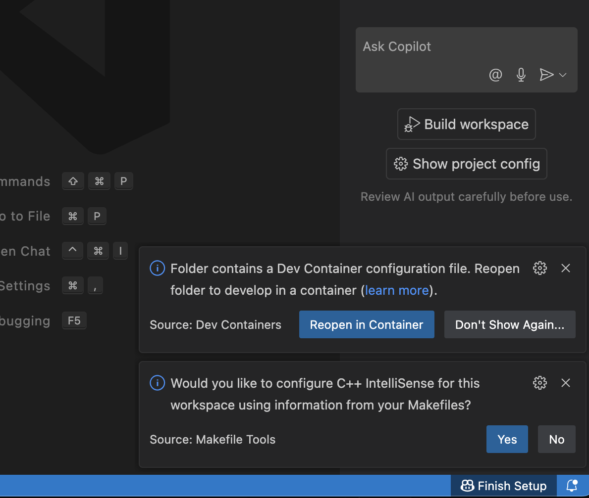
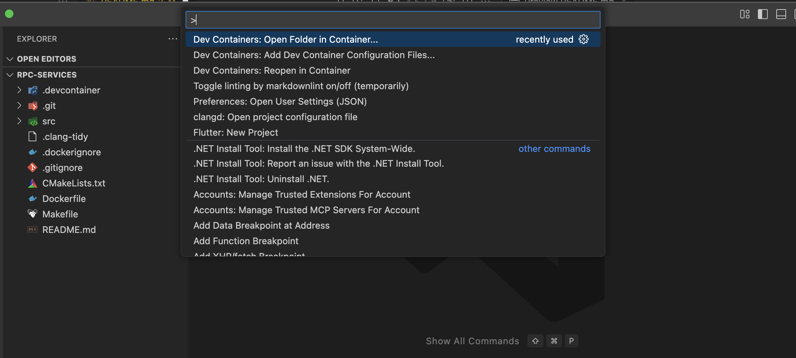

# Setting Up your Dev Environment

## Docker

This project uses a docker dev container to ensure that the development environment is the same as the release environment. First, make sure you have docker [installed](https://www.docker.com/products/docker-desktop/) on your development machine. Verify that docker is installed by running the following:

```bash
$ docker --version

Docker version 28.3.2, build 578ccf607d
```

## Clone the repo

Next, clone the repo to your local machine

```bash
$ cd path/to/local/project/dir
$ mkdir masquerade && cd masquerade
$ git clone git@github.com:masquerade-app/rpc-services.git

Cloning into 'rpc-services'...
remote: Enumerating objects: 48, done.
remote: Counting objects: 100% (48/48), done.
remote: Compressing objects: 100% (36/36), done.
remote: Total 48 (delta 10), reused 43 (delta 8), pack-reused 0 (from 0)
Receiving objects: 100% (48/48), 20.66 KiB | 4.13 MiB/s, done.
Resolving deltas: 100% (10/10), done.
```

## Open the dev container

Docker dev containers are a docker extension specific to VSCode, so we will be using that as our code editor. When you open up your new `rpc-services` directory in VSCode, you should see a pop-up asking you if you want to re-open the directory in a dev container.



If you don't see the pop-up, press `command` + `shift` + `P` to bring up the command center. Select `Dev Containers: Open Folder in Container...`



If this is the first time starting the container, it will start to download the image sepcified in [`.devcontainer/devcontainer.json`](.devcontainer/devcontainer.json). This will likely take some time as the image is over 8 GB!

Once the image is done downloading, you should see all of the files in the repo pop up in the file explorer. Just like that, you have your environment set up with all of the tools and dependencies you need to build, run, and test!

## Building the services

This project uses [CMake](https://cmake.org/) to build the executable and to link libraries and dependencies. The entry point for this build system is found at [`CMakeLists.txt`](CMakeLists.txt).

Lucky for you, there's a [`Makefile`](Makefile) at the root of the project that simplifies the build process for us. Press `control` + `~` to bring up a terminal in your workspace.

```bash
$ pwd
/workspaces/rpc-services

$ make clean  # clean out build directory cache
$ make proto  # generate C++ source files from proto files
$ make build  # compile source files
$ make run    # run the executable

Server listening on 0.0.0.0:50051
```

Alternatively, you can combine everything into a single command:

```bash
$ make all

Server listening on 0.0.0.0:50051
```